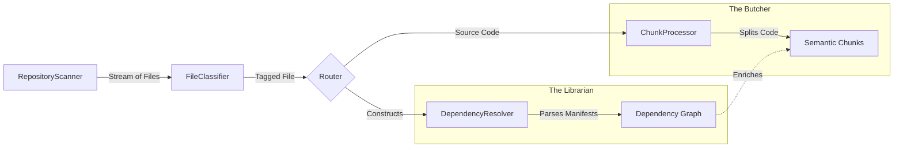

# Modular Pipeline Architecture: Concepts & Integration

## 1. The Core Concept: "The Assembly Line"

To process a complex repository (like your Java Spring + UI app) without building a monolithic mess, we treat the process like a manufacturing assembly line. Each module has a **single responsibility**.

Here is how we interact ensuring **Zero Redundancy**:



## 2. Addressing the Redundancy Concern

You rightfully asked: *If `FileClassifier` identifies "Spring" and `Java`, why do we need `DependencyResolver`?*

**The key is: Identification vs. Extraction.**

| Module | Role | Analogy | Example (UI/Java) |
| :--- | :--- | :--- | :--- |
| **FileClassifier** | **Labeling** | The Triage Nurse | "This is a `pom.xml`. It's a Build Script. It's critical." |
| **DependencyResolver** | **Reading** | The Pharmacist | *Reads* `pom.xml`. "It lists `spring-boot-starter v2.5`. It depends on `jackson-core`." |
| **Chunker** | **Structuring** | The Surgeon | "Here is the `UserController` class. Here is the `login()` method." |

### Why this isn't redundant:
*   The **Classifier** is fast & light. It uses regex/filenames. It tells the system *what* the file is so we know *which* processor to use.
*   The **Resolver** is deep & IO-heavy. It interprets XML/JSON to build a graph. We only run this if the Classifier says "This is a build file".
*   The **Chunker** is language-aware. It parses ASTs. We only run this if the Classifier says "This is source code".

## 3. Workflow for Your Stack (Java Spring + React UI)

Here is exactly how a file travels through this modular pipeline:

### Scenario A: `src/main/java/com/app/UserController.java`
1.  **Scanner**: Finds the file.
2.  **Classifier**: 
    *   Tags it: `Category.SOURCE_CODE`, `Domain.APPLICATION`, `Tech.SPRING`.
    *   *Decision*: Send to **ChunkProcessor**.
3.  **ChunkProcessor**:
    *   Loads `JavaChunker` (from `chunkers/`).
    *    Splits file into Class `UserController` and Method `getUser`.
4.  **Result**: A **Chunk** ready for embedding.

### Scenario B: `pom.xml`
1.  **Scanner**: Finds the file.
2.  **Classifier**: 
    *   Tags it: `Category.BUILD_SCRIPT`, `Tech.MAVEN`.
    *   *Decision*: Send to **DependencyResolver**.
3.  **DependencyResolver**:
    *   Loads `MavenParser`.
    *   Extracts `<dependency>` tags.
4.  **Result**: A **Knowledge Graph Node** representing external libraries.

### Scenario C: `frontend/package.json`
1.  **Scanner**: Finds the file.
2.  **Classifier**: 
    *   Tags it: `Category.CONFIGURATION`, `Tech.REACT`.
    *   *Decision*: Send to **DependencyResolver**.
3.  **DependencyResolver**:
    *   Loads `NodeParser`.
    *   Extracts `react`, `redux`, `axios` versions.

## 4. Implementation Strategy: The "Plugin" Model

We will implement this using a **Registry/Plugin Pattern** to keep it modular.

1.  **The Registry**: We already have `ChunkerRegistry`. We will create a `ParserRegistry` for dependencies.
2.  **The Interface**: All modules share a common understanding of the `FileClassification` object (output of step 2).

### The Code Contract
```python
# The Classifier does the "Routing" logic
classification = classifier.classify(file_path)

if classification.category == FileCategory.BUILD_SCRIPT:
    # Delegate to Resolver
    dependencies = dependency_resolver.resolve(file_path, classification.technology_stack)

elif classification.category == FileCategory.SOURCE_CODE:
    # Delegate to Chunker
    chunks = chunk_processor.process(file_path, classification)
```

## 5. Benefits for You
1.  **Precision**: We don't try to "chunk" a `package.json` into classes/functions (which would look garbage). We parse it correctly.
2.  **Context**: When you search for "Login Controller", the system knows it's a Spring Controller (from Classifier) AND knows it uses Spring Security v5 (from Resolver).
3.  **Scalability**: If you add GoLang later, you just add a `GoChunker` and a `GoModParser`. The pipeline logic (`Scanner` -> `Classifier`) remains untouched.
