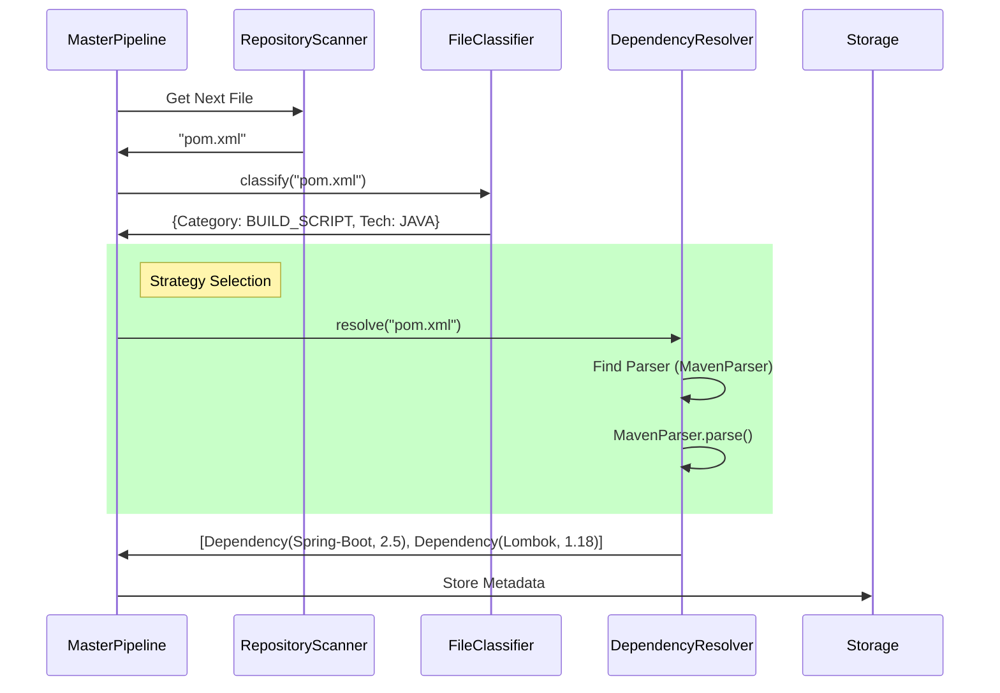

# Dependency Resolver Blueprint & Design

## 1. Zero Redundancy Confirmed
We scanned `src/utils` and confirmed:
*   `file_utils.py`: Generic file IO, MIME types, hashing. **No manifest parsing logic.**
*   `text_utils.py`: Tokenization, NLP metrics, string cleaning. **No semantic parsing logic.**
*   `serialization.py`: JSON/YAML/Pickle wrappers. 

**Conclusion:** Implementing `src/pipeline/dependency_resolver.py` is necessary and adds 0% redundancy.

## 2. The Unified Pattern: "Registry of Strategies"

You are correct that "Strategy" and "Registry" were used interchangeably. They work *together*:
1.  **Strategy**: The Interface (The "How"). Example: `MavenParser` knows *how* to parse `.xml`.
2.  **Registry**: The Lookup (The "Who"). Example: "Given a `pom.xml`, *who* parses it?" -> `MavenParser`.

### The Core Interface

```python
# src/pipeline/dependency_resolver.py

class AbstractManifestParser(ABC):
    """(The Strategy Interface)"""
    @abstractmethod
    def can_parse(self, file_path: Path) -> bool: ...
    
    @abstractmethod
    def parse(self, content: str) -> List[Dependency]: ...

class DependencyResolver:
    """(The Registry + Orchestrator)"""
    def __init__(self):
        self._parsers: List[AbstractManifestParser] = []

    def register(self, parser: AbstractManifestParser):
        self._parsers.append(parser)

    def resolve(self, file_path: Path, content: str) -> List[Dependency]:
        for parser in self._parsers:
            if parser.can_parse(file_path):
                return parser.parse(content)
        return []
```

## 3. Concrete Implementation Blueprint

Here is the exact plan for your stack (Java/React/Python/SQL/Terraform). We do NOT need "independent designers", just simple Parser classes.

### A. Java (Spring)
*   **File**: `src/pipeline/parsers/java_parser.py`
*   **Target**: `pom.xml` (Maven) or `build.gradle` (Gradle).
*   **Logic**: 
    - XML parse `<dependency>` tags using `xml.etree.ElementTree`.
    - Extract `groupId`, `artifactId`, `version`.

### B. React (UI)
*   **File**: `src/pipeline/parsers/node_parser.py`
*   **Target**: `package.json`.
*   **Logic**: 
    - JSON parse.
    - Iterate keys in `dependencies` and `devDependencies`.

### C. Python
*   **File**: `src/pipeline/parsers/python_parser.py`
*   **Target**: `requirements.txt`, `pyproject.toml`.
*   **Logic**: 
    - Regex for `dependency==version`.
    - TOML parser for modern projects.

### D. SQL
*   **File**: `src/pipeline/parsers/sql_parser.py`
*   **Target**: `.sql` files are usually code, but `dbt_project.yml` is the manifest.
*   **Logic**: 
    - **Note**: Pure `.sql` files rarely have "dependency manifests" unless you use DBT.
    - *Plan*: If you use DBT, parse `dbt_project.yml`. If pure SQL, `DependencyResolver` skips it (handled by `RelationshipBuilder` for table-to-table lineage).

### E. Terraform
*   **File**: `src/pipeline/parsers/terraform_parser.py`
*   **Target**: `.tf` files (`provider` blocks and `module` blocks).
*   **Logic**: 
    - Regex scan for `resource "aws_..."` or `provider "aws"`.
    - Extract provider versions.

## 4. Execution Flow (The "Blue Print")

This is how `MasterPipeline` will execute it:



## 5. Next Steps
1.  **Create `src/pipeline/parsers/` directory.**
2.  **Implement `DependencyResolver` class** (The Registry).
3.  **Implement `JavaParser` & `NodeParser` first** (covering your core stack).
