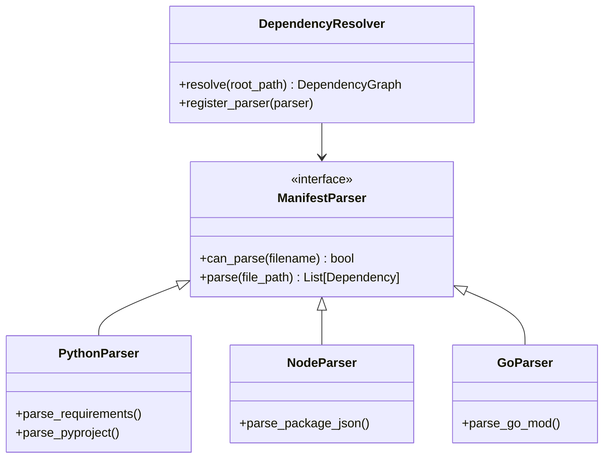

# Deep Dive: DependencyResolver Design

## 1. conceptual Overview
The `DependencyResolver` is responsible for understanding the **external software supply chain** of the repository. While `RelationshipBuilder` understands how internally defined classes call each other, `DependencyResolver` understands what **third-party libraries** and **frameworks** the code relies on.

This is critical for:
*   **Context**: Knowing code uses `torch` vs `tensorflow` changes how we interpret "Model" classes.
*   **Security**: Identifying chunks that use vulnerable versions of libraries.
*   **Search**: Allowing queries like "Show me all Python chunks that use `pydantic`".

## 2. Architecture: Strategy Pattern

We will use a **Strategy Pattern** where we have a generic `DependencyResolver` that delegates to language-specific parsers (`ManifestParser`).



## 3. Supported Manifests

| Language | Manifest Files | Parsing Strategy |
| :--- | :--- | :--- |
| **Python** | `requirements.txt`, `Pipfile`, `pyproject.toml`, `setup.py` | Regex for requirements; `tomllib` for pyproject. |
| **JavaScript** | `package.json` | JSON parsing. properties: `dependencies`, `devDependencies`. |
| **Java** | `pom.xml`, `build.gradle` | XML parsing for POM; Regex or Groovy tokenizer for Gradle. |
| **Go** | `go.mod` | Regex parsing for `require` blocks. |
| **Docker** | `Dockerfile` | Regex for `FROM` instructions (Base image dependencies). |

## 4. Data Model

The resolver will output a structured object that is stored in the `MetadataStore` and linked to the relevant `Chunk` (usually the chunk containing the manifest file).

```python
@dataclass
class Dependency:
    name: str              # e.g., "requests"
    version_spec: str      # e.g., ">=2.25.0"
    type: str              # "runtime", "dev", "peer", "base_image"
    source_file: str       # "requirements.txt"
    line_number: int       # Source line number
    
    # Optional: Resolved metadata from a package registry (PyPI/NPM)
    license: Optional[str] = None
    description: Optional[str] = None
```

## 5. Integration Flow

1.  **Scanning**: The `RepositoryScanner` finds a file like `package.json`.
2.  **Triggering**: `MasterPipeline` sees `FileCategory.CONFIGURATION` and `FilePurpose.BUILD_CONFIG`.
3.  **Parsing**: `DependencyResolver` parses the file.
4.  **Graphing**:
    *   Creates a `DependencyNode` in the knowledge graph.
    *   Creates detailed `Dependency` objects.
5.  **Contextualizing**:
    *   Ideally, we want to know *which code files use which dependency*.
    *   This is the "Advanced" step: Correlating `import pandas` in `analysis.py` with `pandas==1.3.0` in `requirements.txt`.

## 6. Example Output (JSON)

```json
{
  "project_dependencies": [
    {
      "language": "python",
      "source": "requirements.txt",
      "libs": [
        {"name": "fastapi", "version": "^0.68.0", "type": "runtime"},
        {"name": "pytest", "version": "*", "type": "dev"}
      ]
    },
    {
      "language": "javascript",
      "source": "frontend/package.json",
      "libs": [
        {"name": "react", "version": "17.0.2", "type": "runtime"}
      ]
    }
  ]
}
```

## 7. Implementation Roadmap

1.  **Phase 1 (MVP)**: Implement `PythonParser` (requirements.txt only) and `NodeParser` (package.json only). Just extract names and versions.
2.  **Phase 2**: Add `DependencyResolver` class to orchestrate these parsers.
3.  **Phase 3**: Link dependencies to Code Chunks (linking imports to installed packages).

This modular approach allows us to start simple and support more languages over time.
